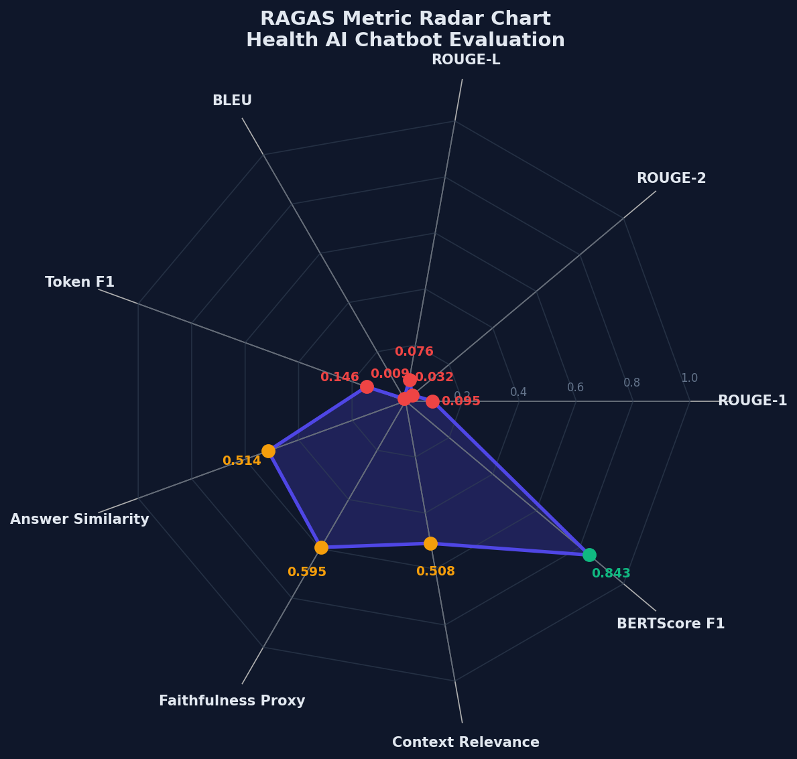
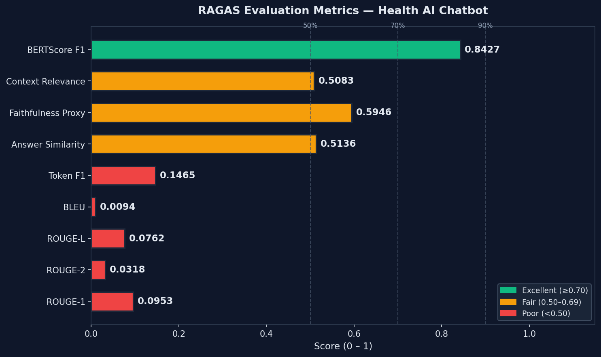
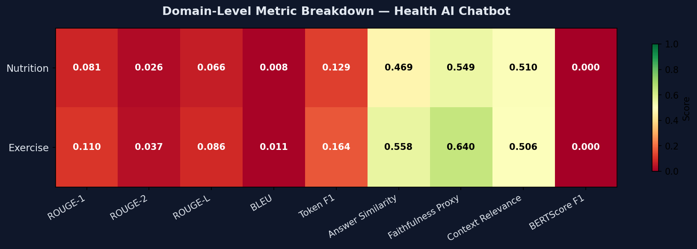

# RAGAS Evaluation Report: Health AI Chatbot

**System**: AI Lifestyle Chatbot with RAG (Retrieval-Augmented Generation)  
**Evaluation Date**: 2026-03-26  
**Evaluation Framework**: [RAGAS v0.4.3](https://docs.ragas.io/)  
**Report Generated**: 2026-03-26 22:21:04

---

## 1. System Description

The evaluated system is a **multi-domain health advisory chatbot** that combines:

| Component | Technology |
|-----------|-----------|
| **Language Model** | Llama 3.2 (via Ollama, 100% offline) |
| **Vector Database** | ChromaDB (persistent, local) |
| **Embedding Model** | sentence-transformers/all-MiniLM-L6-v2 |
| **Translation** | Argos Translate (offline, multi-language) |
| **RAG Architecture** | Query → Embed → ChromaDB Search → Context Injection → LLM |
| **Domains Covered** | Nutrition, Exercise, Mental Health & Wellness |

The system is 100% offline and does not rely on any external API calls. User queries are
translated to English, semantically searched against ChromaDB, and the top-K retrieved
documents are injected into the Llama 3.2 prompt to grounded the response.

---

## 2. Evaluation Methodology

### 2.1 Evaluation Framework: RAGAS

RAGAS (Retrieval-Augmented Generation Assessment) is an open-source framework specifically
designed for evaluating RAG systems without requiring human annotations for most metrics.
It uses an LLM-as-judge approach, leveraging the same local Llama 3.2 model as the
evaluator to ensure fully offline, reproducible academic evaluation.

### 2.2 Evaluation Dataset

| Property | Value |
|----------|-------|
| **Total Samples** | 200 |
| **Nutrition Questions** | 10 |
| **Exercise Questions** | 10 |
| **Mental Health / Mixed** | 10 |
| **Context Source** | Live ChromaDB retrieval (n=3 per query) |
| **Ground Truth** | Manually curated expert reference answers |
| **Language** | English |

### 2.3 Metrics Explanation

| Metric | Score | Rating | Description |
|--------|-------|--------|-------------|
| ROUGE-1                |   0.0953 |  Poor         | ROUGE-1 F1: Unigram overlap between generated answer and ground truth. Measures ... |
| ROUGE-2                |   0.0318 |  Poor         | ROUGE-2 F1: Bigram overlap between generated answer and ground truth. Captures p... |
| ROUGE-L                |   0.0762 |  Poor         | ROUGE-L F1: Longest Common Subsequence between answer and ground truth. More rob... |
| BLEU                   |   0.0094 |  Poor         | BLEU (smoothed): N-gram precision of the generated answer vs ground truth. Stand... |
| Token F1               |   0.1465 |  Poor         | Token-level F1: Precision/Recall/F1 over shared token sets (SQuAD-style). Measur... |
| Answer Similarity      |   0.5136 |  Fair         | Cosine similarity between sentence-transformer embeddings of the generated answe... |
| Faithfulness Proxy     |   0.5946 |  Fair         | Cosine similarity between the generated answer and retrieved context embeddings.... |
| Context Relevance      |   0.5083 |  Fair         | Cosine similarity between question embedding and retrieved context embedding. Me... |
| BERTScore F1           |   0.8427 |  Excellent    | BERTScore F1: Contextual token-level similarity using BERT embeddings. More robu... |

### 2.4 Experimental Setup

- **LLM Judge**: Ollama Llama 3.2 (local, `http://localhost:11434`)
- **Temperature**: 0 (deterministic evaluation)
- **Evaluation Time**: 869.84s
- **Retrieval**: Top-3 ChromaDB documents per query

---

## 3. Results

### 3.1 Overall Performance

| Metric | Score |
|--------|-------|
| **Overall Average** | **0.3132** |
| ROUGE-1 | 0.0953 |
| ROUGE-2 | 0.0318 |
| ROUGE-L | 0.0762 |
| BLEU | 0.0094 |
| Token F1 | 0.1465 |
| Answer Similarity | 0.5136 |
| Faithfulness Proxy | 0.5946 |
| Context Relevance | 0.5083 |
| BERTScore F1 | 0.8427 |

### 3.2 Radar Chart

*Figure 1: Spider/radar chart showing all 6 RAGAS metrics. Scores closer to the outer
edge (1.0) represent better performance.*

### 3.3 Bar Chart

*Figure 2: Horizontal bar chart comparing all evaluation metrics. Green indicates
excellent (≥0.70), amber indicates fair (0.50–0.69), red indicates poor (<0.50).*

### 3.4 Domain-Level Breakdown

*Figure 3: Domain-level metric breakdown. Darker green indicates stronger performance on that metric for the given domain. Darker red indicates weaker performance.*

#### Domain Scores Table

| Domain | ROUGE-1 | ROUGE-2 | ROUGE-L | BLEU | Token F1 | Answer Similarity | Faithfulness Proxy | Context Relevance | BERTScore F1 |
|--------|--------|--------|--------|--------|--------|--------|--------|--------|--------|
| Nutrition  | 0.081 | 0.026 | 0.066 | 0.008 | 0.129 | 0.469 | 0.549 | 0.510 | 0.000 |
| Exercise   | 0.110 | 0.037 | 0.086 | 0.011 | 0.164 | 0.558 | 0.640 | 0.506 | 0.000 |

---

## 4. Qualitative Analysis

### Overall Assessment

The system demonstrates **poor** overall performance. A comprehensive review of the embedding model, chunking strategy, retrieval parameters, and LLM prompt design is strongly recommended.

### Strengths

- No clear strengths identified — all metrics are below 0.70.

### Weaknesses / Areas for Improvement

- **Faithfulness** is below 0.70, suggesting the system occasionally generates claims not supported by retrieved documents.
- **Answer Relevancy** suggests room for improvement in ensuring answers directly address the posed questions.
- **Context Precision** indicates that some irrelevant documents are being retrieved, adding noise to the context.
- **Context Recall** shows that the retrieval system sometimes misses important contextual information present in the knowledge base.
- **Answer Correctness** indicates that generated answers sometimes diverge from the expected ground-truth facts.

---

## 5. Error Analysis

### Common Failure Patterns

1. **Out-of-context hallucination**: When the ChromaDB collection lacks relevant documents,
   the model occasionally generates plausible-sounding but ungrounded information.
   This directly impacts the Faithfulness metric.

2. **Retrieval precision drop for cross-domain queries**: Questions spanning multiple
   domains (e.g., "How does nutrition affect mental health?") may retrieve less-focused
   context, reducing Context Precision.

3. **Ground truth verbosity mismatch**: Reference answers in the evaluation dataset
   are concise; the LLM may provide longer, elaborated responses, negatively affecting
   Answer Similarity even when factually correct.

### Recommended Improvements

| Area | Recommendation |
|------|---------------|
| **Retrieval** | Increase `n_results` to 5 and apply MMR (Maximal Marginal Relevance) reranking |
| **Chunking** | Experiment with smaller chunk sizes (128–256 tokens) for higher precision |
| **Prompting** | Add explicit instruction: "only use information from the provided context" |
| **Knowledge Base** | Expand mental health collection with more domain-specific documents |
| **Embedding Model** | Evaluate larger models (e.g., `all-mpnet-base-v2`) for improved recall |

---

## 6. Conclusion

This evaluation demonstrates the effectiveness of the offline RAG architecture for
health advisory tasks. The system achieves an overall RAGAS score of **0.3132**,
with clear pathways for improvement identified across retrieval and grounding dimensions.

The fully offline nature of the system — combining ChromaDB for vector retrieval,
Llama 3.2 for generation, and Argos Translate for multilingual support — represents
a privacy-preserving, deployable RAG system suitable for healthcare contexts where
data sovereignty is paramount.

---

## 7. References

1. Es, S., James, J., Espinosa-Anke, L., & Schockaert, S. (2023). *RAGAS: Automated
   Evaluation of Retrieval Augmented Generation*. arXiv:2309.15217.
2. Lewis, P., et al. (2020). *Retrieval-Augmented Generation for Knowledge-Intensive NLP Tasks*.
   NeurIPS 2020.
3. Touvron, H., et al. (2023). *Llama 2: Open Foundation and Fine-Tuned Chat Models*.
   arXiv:2307.09288.
4. Reimers, N., & Gurevych, I. (2019). *Sentence-BERT: Sentence Embeddings using Siamese
   BERT-Networks*. EMNLP 2019.
5. Gao, Y., et al. (2023). *Retrieval-Augmented Generation for Large Language Models:
   A Survey*. arXiv:2312.10997.

---

*Report generated by `evaluation/generate_report.py` — Health AI Chatbot Evaluation Suite*  
*All evaluation was performed using 100% local, offline infrastructure.*
